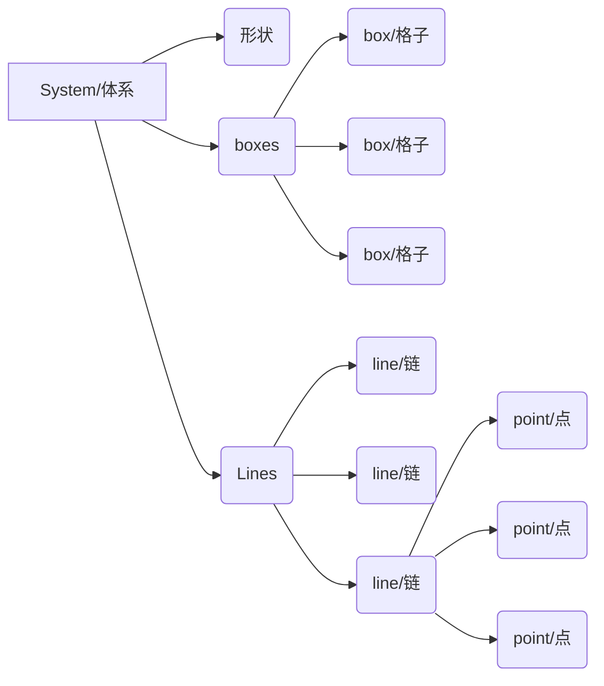

# 聚合物力学行为的蒙特卡罗模拟的代码简介文档

## 介绍

本代码在六边形空间内对可自动生成（通过自避行走方式）的聚合物链进行格点法模拟，来模拟真实情况下的聚合物链的行为。

## 架构

### MC_toolbox
>MC_toolbox内含有本代码的核心架构。

#### 1. System（体系） （对象）
> 该对象对应研究的体系，是所有操作、模拟的载体。
##### 创建方法
输入形状数组。例如：
> aSystem = System([12,12])

以上代码生成了一个大小为12*12的六边形网络。

#####  属性 

size: 六边形网络的大小，为一个长度为2的list对象，值等于输入值。
boxes: 二维矩形numpy.array对象，长宽等于输入值，每个格子中为对应坐标的格子（hex_box）对象。
lines: 二维list对象，其中每一个元素为对应一条链的list，该list的元素为Kuhn链段（Kuhn）对象。

##### 方法

1. random_locate():
以六角坐标（hex_coordinate）对象的形式，返回网络内的随机一点。
2. line_generate(DP):
在体系内、随机位置出发，尝试生成一条给定聚合度（长度）的链，并加入到自身的lines属性中。
生成时遵循单格点数不得超过2的条件。如果生成失败（链生长进了死胡同），则会生成一条长度较短的链。
如果成功生成了给定长度的链，则返回0。如果生成了一条较短的链，则会返回1。
3. draw_Lines(line_num):
输入值为一数组（例如：[0,2,3]）,将会在pyplot画板上把体系里指定的几条链绘画出来。
如果没有输入或输入值为'all'，则会画出体系中的所有链。
该函数无返回值。
4. rdpoint():
返回一个二元list，第一个元素对应体系中的某条链，第二个元素对应该条链上的某个点。
5. point_motive(point_num):
输入值为一个二元list，其中第一个元素对应体系中某条链，第二个元素对应该条链上的某个点。
该函数会根据以下公式计算热运动能量：
// 不想打公式
之后判断该位置是否存在内摩擦、结晶情况并判断相应能量；
根据以下公式，计算运动前后的键能变化：
// 不想打公式
根据能量关系判断point_num所对应的点是否运动。
如果运动，移动所对应的点的位置坐标，并返回1；反之直接返回0。
6. add_line(arr):
为体系增加一条指定的链。
输入值为一二元二维坐标，其中arr[0]对应加入链各点的横坐标，arr[1]对应纵坐标。其长度必须严格相等。
7. calc_rd(line_num):
计算第line_num条链的均方末端距并返回。line_num必须以int形式输入。

#### 2. hex_coordinate（六角坐标） （对象）
> 该对象象征着一个点的坐标，为简便代码编写，为其增添了一些功能。
##### 创建方法：
输入位置数组。例如：
> aCoordinate = hex_coordinate([3,4])

以上代码生成了一个在（3,4）点的坐标。
##### 属性
x,y:该坐标的横纵坐标值。
##### 方法
1. Transform_2_Ortho()：
将该坐标的x,y坐标转化为直角坐标系内坐标并以list形式返回。
2. around(size):
输入值为一二元的、对应体系网络大小的形状list。
返回值为一list，其中每个元素均为在该坐标周围且不超出体系网络的六角坐标对象。
3. distance(other):
输入值为另外一个坐标，返回这两个坐标之间的距离（浮点数形式）。
4. tolist():
以list形式返回该点的横纵坐标。
5. 加法运算：
返回一六角坐标对象，其横纵坐标分别为两六角坐标横纵坐标之和。
6. 减法运算：
返回一六角坐标对象，其横纵坐标分别为两六角坐标横纵坐标之差。

#### 3. hex_box（格子） （对象）
>  对应体系中的一个格子。
##### 创建方法：
输入坐标（六角坐标形式）。
##### 属性：
location:该点的坐标（六角坐标形式）。
content:
长度为0-2之间的二维数组，每个元素均为一个二元list，其中每个元素均代表该格内含有第x条链上第y个点。
##### 方法：
1. draw_box():
在pyplot画板上画一个以自己坐标为中心的灰色虚线六边形格子。

#### 4. Kuhn（Kuhn链段，或称为点） （对象）
> 对应一个单位研究对象。
##### 创建方法：
输入坐标（六角坐标形式）。
##### 属性：
location: 该点的坐标。
##### 方法： 
1. grow(possible_location):
输入值为一list对象，其中的元素均为六角坐标形式。
从中随机挑选一个位置，在此处创建一个点（Kuhn对象）并且返回之。
2. 减法运算
返回两者六角坐标之差（返回值为六角坐标形式）。
